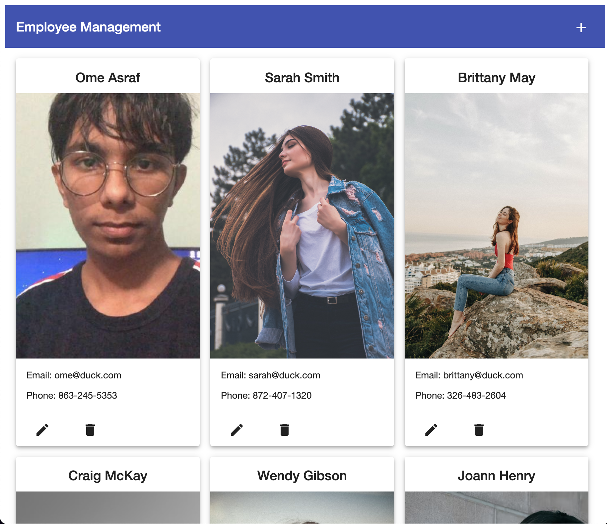
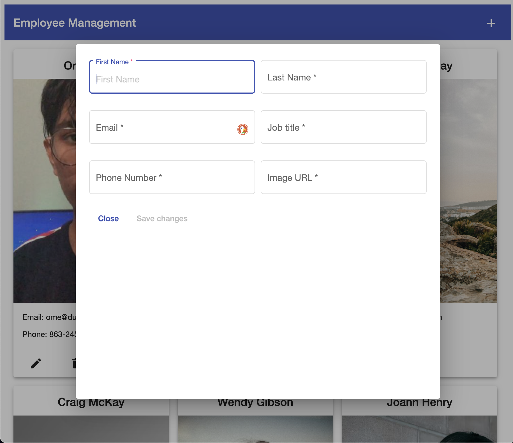
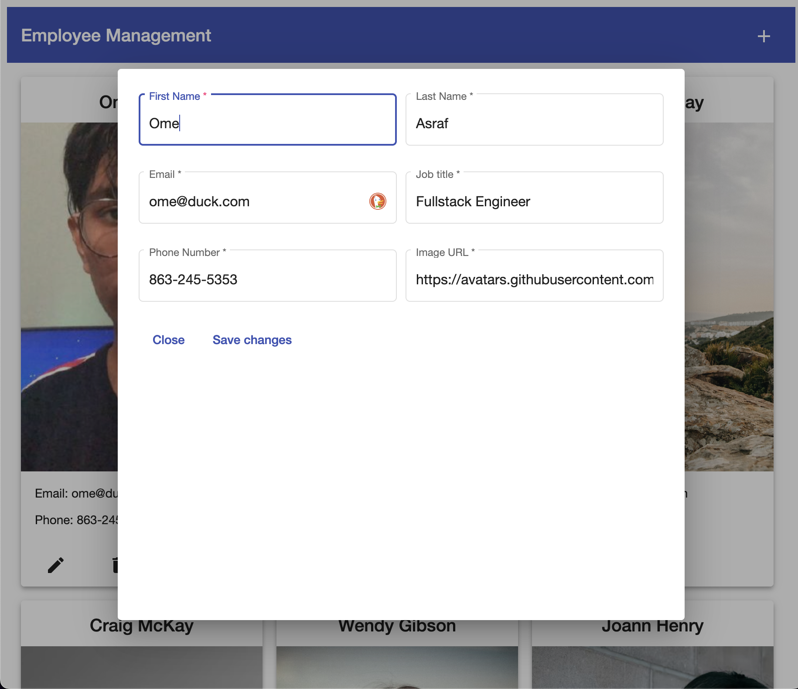

# Employee Management

An employee management tool built using Java SpringBoot and Angular

## Requirements

For building and running the application you need:

- [Java](https://www.oracle.com/java/technologies/downloads/)
- [Maven](https://maven.apache.org)
- [Angular](https://angular.io)
- [Node.js](https://nodejs.org/en/)

## How To run?
### Backend

There are several ways to run a Spring Boot application on your local machine. One way is to execute the `main` method in the `com.omeasraf.EmployeeManagement.EmployeeManagementApplication` class from your IDE.

Alternatively you can use the [Spring Boot Maven plugin](https://docs.spring.io/spring-boot/docs/current/reference/html/build-tool-plugins-maven-plugin.html) like so:

```shell
mvn spring-boot:run
```

### Frontend

## Development server

Make sure you have [Angular](https://angular.io) installed on your device first.
```shell
npm install -g @angular/cli
cd Frontend
npm install
```
Run `ng serve` for a dev server. Navigate to `http://localhost:4200/`. The application will automatically reload if you change any of the source files.


### Screenshots
#### Home


#### Add

#### Edit
